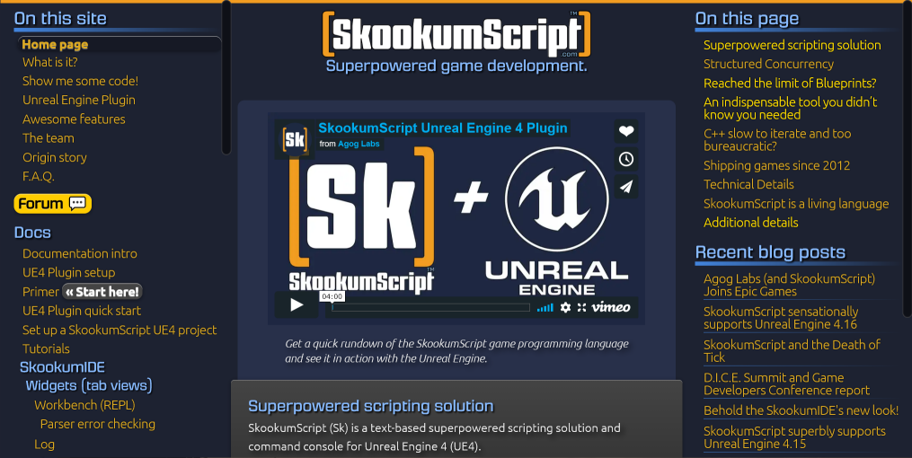
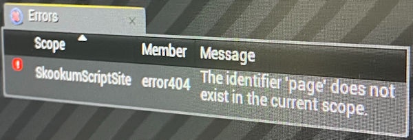

# SkookumScript Web Pages and Docs

SkookumScript is a video game programming language owned by Epic Games, Inc.

This repository contains files used to generate the [SkookumScript web pages](https://skookumscript.com) using [Jekyll](https://jekyllrb.com/) and hosting them on GitHub (or locally running Jekyll on your computer).

## Issues and contributions

The SkookumScript web pages are still a work in progress.

Please help evolve these pages by [making requests and noting any issues](https://github.com/EpicSkookumScript/EpicSkookumScript.github.io/issues) and we'll prioritize those areas. Even better, create your own contributions then make a pull request to get it added -- see [Jekyll](https://jekyllrb.com/) to learn how.
